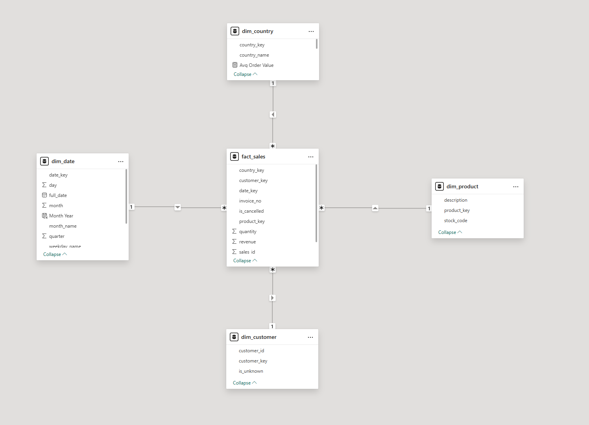
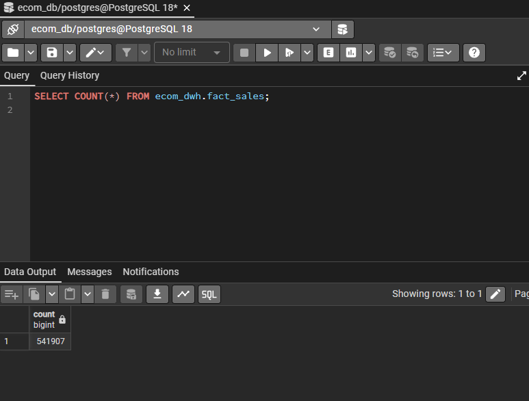

# E-Commerce Business Intelligence Projekat

Ovaj projekat predstavlja kompletan **Business Intelligence (BI) pipeline** za e-commerce podatke, koji obuhvata inicijalizaciju baze, ETL proces, dizajn skladišta podataka i izradu interaktivnog Power BI dashboarda.

---

## 📊 Pregled projekta

- **Domena:** E-Commerce analitika  
- **Izvor podataka:** Kaggle – Online Retail Dataset  
- **ETL alat:** Custom Python (Pandas + SQLAlchemy)  
- **Baza podataka:** PostgreSQL  
- **BI alat:** Power BI  
- **Dizajn šeme:** Star Schema (fakt i dimenzijske tabele)

---

## 🗂 Arhitektura sistema

Kaggle CSV
↓
Python ETL
↓
PostgreSQL (Data Warehouse)
↓
Power BI Dashboard

---

## 🏗 Dizajn skladišta podataka (Data Warehouse)

Skladište podataka je dizajnirano korištenjem **Star Schema** modela, što omogućava efikasnu analitiku i jednostavno povezivanje sa BI alatima.

### Fakt tabela
- `fact_sales` – transakcioni podaci o prodaji

### Dimenzijske tabele
- `dim_date` – vremenska dimenzija
- `dim_product` – proizvodi
- `dim_customer` – kupci
- `dim_country` – države

### Star Schema model

---

## 🔄 ETL Proces

ETL pipeline se sastoji od tri glavna koraka:

### 1️⃣ Load Source
- Učitavanje sirovih CSV podataka u tabelu `ecom_source.raw_invoices`

### 2️⃣ Transform Staging
- Čišćenje, normalizacija i priprema podataka
- Transformacija u `ecom_staging.stg_sales`

### 3️⃣ Load Data Warehouse
- Popunjavanje dimenzijskih tabela
- Učitavanje `fact_sales` tabele sa surrogate ključevima
- Osiguranje referencijalnog integriteta

### Broj redova u fact tabeli

---

## ⚙️ Inicijalizacija baze podataka

Projekat sadrži **posebne skripte za setup baze**, koje se izvršavaju **jednom na početku projekta**:

- `create_db.py`  
  Kreira PostgreSQL bazu `ecom_db` ukoliko ne postoji.

- `init_db.py`  
  Izvršava SQL DDL skripte i kreira:
  - šeme (`ecom_source`, `ecom_staging`, `ecom_dwh`)
  - sve potrebne tabele

Ove skripte su odvojene od ETL procesa kako bi se jasno razdvojila:
- infrastruktura (setup baze)
- obrada podataka (ETL)

---

## 🧪 Pomoćne i verifikacione skripte

Pored glavnog ETL-a, projekat sadrži dodatne skripte za provjeru i analizu:

- `check_db_data.py`  
  Provjerava:
  - da li postoji konekcija na bazu
  - koje tabele postoje u `ecom_dwh` šemi
  - broj redova po tabelama
  - uzorak podataka iz `fact_sales`

- `analyze_pbi.py`  
  Eksperimentalna skripta za pokušaj programskog povezivanja sa Power BI modelom
  (nije dio osnovnog BI pipeline-a, služi za istraživanje i testiranje).

Ove skripte **nisu obavezne za rad dashboarda**, ali služe za:
- debugging
- validaciju podataka
- demonstraciju razumijevanja BI okruženja

---

## 📈 Power BI Dashboard

Power BI dashboard omogućava:

- KPI pregled:
  - Ukupan prihod
  - Broj narudžbi
  - Prosječna vrijednost narudžbe
  - Broj otkazanih narudžbi
- Prihod po državama (Map vizual)
- Top 10 proizvoda po prihodu
- Mjesečni trend prihoda
- Interaktivne filtere:
  - Godina
  - Država
  - Otkazane narudžbe (yes/no)

### Pregled dashboarda

---

## 📁 Struktura repozitorija

├── etl/
│ ├── common.py
│ ├── 01_load_source.py
│ ├── 02_transform_staging.py
│ └── 03_load_dwh.py
├── sql/
│ ├── 00_init_schemas.sql
│ ├── 01_source_ddl.sql
│ ├── 02_staging_ddl.sql
│ └── 03_dwh_ddl.sql
├── create_db.py
├── init_db.py
├── check_db_data.py
├── analyze_pbi.py
├── requirements.txt
├── README.md
└── dashboard.pbix

---

## 📦 Zavisnosti (Dependencies)

Sve Python zavisnosti su definisane u `requirements.txt` fajlu:

pandas
sqlalchemy
psycopg2-binary
python-dotenv
openpyxl

---

## ✅ Ključni ishodi učenja

- Dizajn i implementacija Star Schema modela
- Razdvajanje setup, ETL i analitičkih faza BI sistema
- Izrada custom ETL pipeline-a u Pythonu
- Rad sa PostgreSQL skladištem podataka
- Izrada interaktivnih Power BI dashboarda
- Primjena DAX mjera za poslovnu analitiku

---

## 👤 Autor

**Emrah Jamakovic**  
Business Intelligence projekat